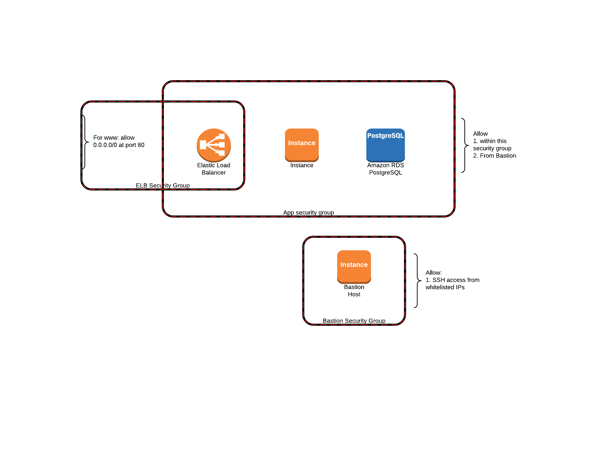

<!-- START doctoc generated TOC please keep comment here to allow auto update -->
<!-- DON'T EDIT THIS SECTION, INSTEAD RE-RUN doctoc TO UPDATE -->
**Table of Contents**  *generated with [DocToc](https://github.com/thlorenz/doctoc)*

- [FastUp: Continuous Delivery of Micro-services on AWS](#fastup-continuous-delivery-of-micro-services-on-aws)
- [Technical Introduction](#technical-introduction)
- [Use case narrative](#use-case-narrative)
- [Usage](#usage)
  - [Make Infrastructure](#make-infrastructure)
  - [Deploy Application](#deploy-application)
- [Diagrams](#diagrams)
  - [VPC](#vpc)
  - [Autoscaling](#autoscaling)
  - [Identity and Access Management](#identity-and-access-management)
  - [Events](#events)
  - [Host and Port Security](#host-and-port-security)
- [Cloudformation Templates](#cloudformation-templates)
  - [Network template](#network-template)
  - [Bastion template](#bastion-template)
  - [Artifact Bucket template](#artifact-bucket-template)
  - [IAM template](#iam-template)
  - [Messaging template](#messaging-template)
  - [Deployer Lambda template](#deployer-lambda-template)
- [Why use FastUp](#why-use-fastup)
  - [Automation](#automation)
  - [Distributed Micro-Services Platform](#distributed-micro-services-platform)
  - [AWS Native](#aws-native)
  - [Commercial Support](#commercial-support)
- [FastUp and Micro-services](#fastup-and-micro-services)

<!-- END doctoc generated TOC please keep comment here to allow auto update -->

# FastUp: Continuous Delivery of Micro-services on AWS
FastUp enables enterprises to release software faster, with minimal operations disruption. This way businesses can experiment with new products and features with very little impact and lower costs. FastUp is native to Amazon Web Services and uses AWS products and APIs to automate deployment completely. FastUp lives in your amazon account and does not introduce any third party service. 
  
# Technical Introduction
As of version 0.1.2 FastUp is a Maven Plugin and supports automatic deployment of tomcat micro-services in an autoscaling group with an associated RDS database. FastUp is a pre-designed platform that using organizations can customize and use as an internal service. It is FastUp's near term goal to provide a completely automatic dependency management so that dependent applications can be managed as one unit. Pricing is same as elastic beanstalk, meaning, you pay for resources that you create. FastUp requires a three tier VPC network setup and can be used only in AWS regions that support Lambda. FastUp can create all required resources such as VPC, IAM roles, S3 buckets that are needed as a prerequisite to using FastUp. Alternatively, FastUp can be configured to use resources that your AWS account may already have. FastUp does not send any data out of your environment; it does download default versions of lambda function code and cloudformation templates from the FastUp S3 bucket which is publicly readable.          

# Use case narrative
 `(Author's note: This is a fictional narrative of the use case. If you would like to skip to the juicy technical documentation, please skip to: )`

Archie, Betty and Chuck are developers in the HR, Finance and Production departments of the Lodge corporation and Dilton is the chief architect. Hiram runs the sales and marketing department and is tasked with building a user interface application that matches sales quotas to production schedules and compensates sales employees based on their tenure and performance. Hiram's task is tough. He has to cross department lines to get Archie, Betty and Chuck to give him what he wants. Archie, Betty and Chuck constantly complain that Hiram changes requirements and expects them to deliver systems interfaces in unreasonable timeframes. Even though most departments in Lodge corporation do use the latest and greatest software products and platforms, it is not easy to wield these powerful tools in a cost effective manner. Life is a constant chase to get new versions of applications out of the door and ensure that sales staff are happy, not only with features, but also, with ease of use. Deep down, all of them understand that, political fights and technical abilities aside, sales incentives and correct attribution is extremely important for Lodge corporation. 

Everyone knew that there was a better way. They knew that the AWS cloud and it's ability to be managed by APIs presented a unique opportunity to configure infrastructure as needed rather than provision it for once. They studied AWS, took lessons and obtained certifications. They tasked Dilton with coming up a solution for their problems. The goal was to create a tool of tools that would enable Archie, Betty and Chuck to release software very fast and with minimal disruption to any operations. Additionally, they would have liked for the solution to be completely auto-scalable and resilient. That was the starting point. In future, they would also have liked for the system to report on itself and allow anyone with access to enhance the system. Dilton had 3 months to propose the first iteration of the solution.

Dilton set about researching this. He tried elastic beanstalk, OpsWorks and a few other third party tools. They all did great and had many great benefits and shortcomings. In the end, Dilton decided that using a third party tool makes Lodge corporation dependent on the third party and goes against the grain of in-house custom development. Also, AWS's own tools were great, just that they were like a diamond in the rough. Dilton, set about creating his own framework that leveraged standard languages, tool chains and AWS-cloud-native products. He quickly gravitated towards Cloudformation templates that allowed him to standardize the application platform with any software he pleased - or any software that Archie, Betty and Chuck already used. He was able to use cloud-init to install software on EC2 instances as they came up. In the same set of templates, Dilton included one for RDS and integrated the RDS endpoint with the EC2 instance. He ensured that the client piece of software that initiated deployments was light weight by using Lambda functions to coordinate and orchestrate all deployment tasks. In this way, he was able to propose a system where Archie, Betty and Chuck simply uploaded a deployable file and the system deployed applications to an EC2 autoscaling group secured inside a VPC. All of the platform was codified in cloudformation templates. He versioned those templates so that Archie, Betty and Chuck could use any version of the platform that suited them best. Enhancing the platform was reduced to a matter of releasing new version of the cloudformation templates. This way Dilton could continue to work on creating the platform of tomorrow while serving today's needs. 

Dilton was very excited and on the 3 month anniversary, presented this solution to Archie, Betty, Chuck and Hiram. At first, they were very unsure. They felt like the framework was another hurdle for them to jump over. It was only when Dilton showed them how easy it was to simply upload a file and deploy that they were willing to give it a shot. Everyone agreed to give this a try and meet after a month of trying.

On the 4 month anniversary, everyone met again. Turned out that there were a few hiccups in the beginning. Archie, Betty, Chuck had to deals with some very specific assumptions that they had previously made about their platform. They had to make few minor modifications to their software packages to work better with the new platform. Once those changes were done, very quickly, they got used to the ease or deploying with the new tool. They found themselves releasing more often than they used to. The found that if they just cleaned up previous releases and coordinated dependencies correctly, they could really release as much as they want at whatever schedule they wanted. They found that they no longer had to complain about frequent requirement changes. This rubbed off on Hiram and he was bolder and more forthcoming with new features and requirements. The sales people loved this pace of work, gained a new trust for Hiram and encouraged him to become pro-active in product modifications. The team came up with a list of bugs that had to be fixed immediately and then meet again in a month. Dilton had a big job of fixing bugs and smoothing out things.

On the 5 month anniversary, life had changed! It was no longer a matter of chasing release plans and ensuring a satisfied customer. It was now a matter of what is the right thing to develop. Releasing software was an eventual reality that need not be managed anymore. Everyone was focused on asking the right questions to Hiram and the sales people and no one questioned the release process. Dilton had thought that he will have to deal with a lot of new bug reports, instead, the team had a long list of new features they wanted in the tool so that they can become even more speedier in releasing software. Dilton offered to build a UI to manage running software. They decided to meet again in a month.

On the 6 month anniversary, Dilton's new UI was ready. Archie, Betty and Chuck were delighted. They could see the benefits of sticking to a standard, cloud-native solution that worked so well for Hiram and the sales department. They were able to produce software, test and promote specific versions at a pace they never thought possible previously. The primary task at hand was no longer managing large projects and releases but, instead, was to test and communicate new product features. They ended the meeting on a high note and lived happily ever after.  

# Usage
As of version 0.1.2, the FastUp software is available as a maven plugin in maven central. There are two main named maven goals that developers can configure. One named `make-base-infrastructure` creates a new VPC, subnets, IAM roles, policies and buckets for use with FastUp. The other, named `deploy-app`, hooks into the deploy phase of a war file project and uploads the war file with certain metadata to the S3 bucket from the first goal. It is possible to configure the `deploy-app` goal with pre-existing AWS resources so that developers can re-use their existing resources such as VPC, iam roles, buckets etc. Please see the sample project for a detailed example of configuring a war file project.
The plugin also supports a third goal, the standard maven `help:describe` goal. This prints out all available configuration options and meanings of each option.
## Make Infrastructure
- Purpose
The `make-base-infrastructure` maven goal creates all required infrastructure resources such as networks, IAM roles, lambda functions, internet gateways and nat gateways amongst other resources. For a full listing of resources look at the [base infrastructure template](fastup-maven-plugin/src/main/cloudformation/main.template).
- Configuration options

|Option                         |Required/Default   |Valid values                                                                       |Purpose                                                                         |
|------------------------------ |------------       |--------------------------------------                                             |--------------------------------------------------------------------------------|
|availability-zones             |                   |Comma separated availability zone names from AWS. Examples: us-east-1a,us-east-1b  |FastUp creates a new all subnets in the provided availability zones.|
|ssh-key-pair-name              |                   |An AWS EC2 ssh key pair name.                                                      |This enables interactive log on access to an instance started by FastUp|
|artifact-bucket-name           |                   |Must follow naming rules for buckets.                                              |A name for the bucket that will be created in your account for uploading artifacts and configurations. |
|aws-auth-profile               |                   |A profile name that is configured on the host running fastup maven plugin.         |To authenticate against AWS in order to run cloudformation templates|

## Deploy Application
- Purpose
The `deploy-app` maven goal uploads the war file created in the standard maven deploy phase to the artifact bucket in S3. S3 triggers an event that executes a lambda function that deploys the uploaded war file.
- Configuration options
Some of these configuration options are stored as metadata on the S3 object that this plugin creates.
 
|Option                         |Required/Default   |Valid values                                                                       |Purpose                                                                         |
|------------------------------ |------------       |--------------------------------------                                             |--------------------------------------------------------------------------------|
|availability-zones             |                   |Comma separated availability zone names from AWS. Examples: us-east-1a,us-east-1b  |FastUp creates a new all subnets in the provided availability zones.|
|ssh-key-name                   |                   |An AWS EC2 ssh key pair name.                                                      |This enables interactive log on access to an instance started by FastUp|
|artifact-bucket-name           |                   |Must follow naming rules for buckets.                                              |A name for the bucket that will be created in your account for uploading artifacts and configurations. |
|aws-auth-profile               |                   |A profile name that is configured on the host running fastup maven plugin.         |To authenticate against AWS in order to upload the war file to S3|
|health-check-url               |                   |Follows AWS ELB health check url requirements.                                     |If this url responds with a HTTP 200 response within the configured timeout, the application is considered to be healthy|
|context-config-url             |                   |A file path relative the maven project base directory                              |This file is used to configure war file deployment in tomcat|
|context-root                   |                   |The single name which can be used in the url for the application                   |This is the root after the first "/" after the fqdn in the url bar.|
|app-fqdn                       |                   |A dns name for the application corresponding to a Route 53 hosted zone             |This mapped as a CNAME to the ELB url in route 53. This, with the context root becomes the url of the application| 
|db-name                        |                   |Should follow rules for naming an RDS database                                     |A database with this name will be created in RDS|
|db-username                    |                   |Should follow rules for database user                                              |The user name that the application will use to connect with RDS|
|db-password                    |                   |Should follow rules for database password                                          |The password that the application will use to connect with RDS|

# Diagrams
## VPC 
This diagram shows how FastUp creates its VPC configuration through the `make-base-infrastructure` maven goal.

## Autoscaling
This diagram shows how a single app is setup in an autoscaling group.

## Identity and Access Management
This diagram shows various IAM resources and where those get used.

## Events
This diagram shows the relation between AWS resources when they participate in an app deployment 

## Host and Port Security
This diagram shows how applications are secured from each other.

# Cloudformation Templates
FastUp is completely native to AWS. All constructs and concepts used within FastUp are standard AWS products. To achieve this in a standard way, FastUp uses cloudformation json templates. Where needed, FastUp may use custom code to supplement cloudformation, for example, downloading application code and integrating it with the RDS database is done using EC2 user data scripts that are executed via CloudInit. Here is a listing of major templates. For a complete list, please see the /src/main/cloudformation folder. The base infrastructure template consists of one main template and multiple nested templates. Many AWS users may already have parts of base infrastructure setup on their account in differing configurations. For example, the main template creates an S3 bucket with an event configuration; users who already have a bucket can skip creating a new bucket but, just create the event configuration. The main template accepts parameters that allow users to customize the infrastructure. Please see the rest of the template documentation for a listing of those parameters.

## Network template
The network template describes all network infrastructure required for FastUp. In addition to network and vpc resources, this template also describes a bastion host that allows users to ssh into other resources. The following parameters are accepted in order to customize creation of network resources.

|Parameter Name                     |Valid Values                               |Purpose                                                        |
|-------                            |--------                                   |---------------                                                |
|AvailabilityZones                  |AWS availability zones separated by comma  |Network resources will be created in these availability zones  |
|ProjectNameParm                    |A string                                   |This will be used to create Name tag of resources where needed |

## Bastion template
The bastion template describes one EC2 instance in a public subnet. Once deployed, users can get interactive access to the OS prompt using an SSH client of their choice. This instance is placed inside an autoscaling group with maximum size and minimum size both equal to 1. 

|Parameter Name                     |Valid Values                               |Purpose                                                        |
|-------                            |--------                                   |---------------                                                |
|BastionSecurityGroupParam          |Valid security group. Should allow SSH.    |This will be applied to the bastion host.                      |
|PubSubnetsParam                    |A list of comma separated subnet ids.      |The bastion host will be created in one of these subnets. These subnets should should have a route to and from the internet    |

## Artifact Bucket template
The artifact bucket template describes a single bucket where FastUp uploads deployable files. It also describes an event that is triggered each time a deployable is uploaded into the bucket. 

|Parameter Name                     |Valid Values                               |Purpose                                                        |
|-------                            |--------                                   |---------------                                                |
|DeployerLambdaFunctionArnParm      |A valid lambda function ARN.               |When a deployable artifact is uploaded, this lambda function is executed.                      |
|ArtifactBucketNameParm             |A valid, unique S3 bucket name.            |This is used as the name of the new artifact bucket.       |
|ProjectNameParm                    |A Tag Key.                                 |Use to tag the bucket.|

## IAM template
The IAM template describes IAM roles and policies as execution roles for lambda functions and as instance profile for application instances. This template does not take any parameters.

## Messaging template
The messaging template describes SNS topics that can be used for notifications as well as for triggering lambda functions.

|Parameter Name                     |Valid Values                               |Purpose                                                        |
|-------                            |--------                                   |---------------                                                |
|AppDeployerLambdaFunctionArnParm   |A valid lambda function ARN.               |The deployer lambda function that will subscribe to SNS messages.|

## Deployer Lambda template
The Deployer Lambda template describes the AWS lambda function that waits for deployables to be uploaded to the artifact S3 bucket and then deployed to EC2. The code for these lambda functions is packaged and stored in a publicly accessible read-only bucket owned by FastUp. 

|Parameter Name                             |Valid Values                               |Purpose                                                        |
|-------                                    |--------                                   |---------------                                                |
|LambdaFunctionExecutionRoleParam           |A valid IAM role ARN.                      |This IAM role is used as a service role for the Lambda function.                      |
|DeployerLambdaFunctionCodeS3BucketParam    |A valid lambda function ARN.               |This is the URL to the S3 bucket where the lambda function code is stored.                      |
|DeployerLambdaFunctionCodeS3KeyParam       |A valid lambda function ARN.               |This is the key of the lambda function code.                      |
|DeployerLambdaFunctionSecurityGroupsParam  |Comma separated security group ids.        |These security groups are applied to the lambda function.                      |
|DeployerLambdaFunctionSubnetIdsParam       |Comma separated list of subnet ids.        |The subnets in which AWS will allocate ENIs for lambda functions.                      |

# Why use FastUp
## Automation
FastUp enables organizations to automate the software release management process with minimal disruptions to operations. FastUp is a technical product to be implemented and maintained by the IT organization, however, FastUp is eventually beneficial for the entity that uses the software. Such entity could be an individual, another business or internal business partners. 
Traditional IT processes may require a significant effort and coordination on multiple fronts and may require down time of software[1][1],[2][2]. Additionally, each change also carries a significant burden of testing, review and approvals by entities that may not be final users of the system. For example, a business department head may be asked to approve specific changes to a system based on their understanding of customers wants and needs. As another example, business analysts and testers who validate the system before a production release are only a proxy for final fitness for purpose. Not only is validation and approval by proxies an error prone process but it also consumes a large amount of time before customers can see the product. This type of burden disables the organization from offering better products and new features to customers.

FastUp reduces or eliminates the burden of software changes and hence allows software development organizations to meet customer demands at a faster rate, before alternatives satisfy the demand. FastUp encourages IT organizations to flip the development process on its head by relying on frequent customer feedback and greatly reduce time to market. FastUp encourages customers to truly realize some of the more popular promises of software development methodologies.
 
## Distributed Micro-Services Platform
FastUp takes a specific position within the application development practice. It is built to work best with a distributed micro-service architecture using basic AWS products. A distributed micro-service architecture happens to be an important strategic way forward for Application Development and Delivery (AD&D) function[3][3],[4][4]. FastUp is built with the philosophy that micro-services, which are small, completely independent software products, should be easy to construct and easy to destroy without impact to ongoing operations. FastUp promotes this by offering cutomizable templates for micro-services and automated deployment of such templates.
   
## AWS Native 
FastUp is designed only for Amazon Web Services. It is a great fit for organizations that already use AWS and want to take the next step of automating releases. Other than adopting the principles and philosophies of releasing often and fast, there is no new technology to learn. Your existing AWS support will support all resources created via FastUp. Additional support for FastUp itself is available in the form of issues on this GitHub repository.
  
## Commercial Support
Commercial support is available via www.fastup.com. Commercial support provides additional benefits such as ensuring best practice adoption, managed services contracts and continual updates specific to your organization.
 
# FastUp and Micro-services 
FastUp is a tool created for IT organizations. Micro-services[5][5],[6][6] is a collection of design and architecture principles that are used by developers to realize functionality. FastUp is built around the premise that aggregate functionality should be delivered by multiple very small applications that each deliver a specific sliver of funtinoality. Scaling, Re-sizing, changes and other operational activities on individual small applications should not affect the aggregate functionality. FastUp can be used just as easily to deploy a single monolothic application[7][7],[8][8] as it can be to deploy micro-services. 
 

[1]: https://www.forrester.com/report/Haste+Does+Not+Make+Waste+If+You+Improve+Your+Service+Delivery/-/E-RES118905
[2]: https://www.forrester.com/report/Brief+Embrace+The+Need+For+Speed+To+Avoid+Ugly+DevOps+Practices/-/E-RES122277
[3]: https://www.forrester.com/report/Application+Modernization+Service+By+Microservice/-/E-RES122550 
[4]: https://www.forrester.com/report/Microservices+Have+An+Important+Role+In+The+Future+Of+Solution+Architecture/-/E-RES123031 
[5]: http://www.martinfowler.com/articles/microservices.html 
[6]: https://en.wikipedia.org/wiki/Microservices 
[7]: http://microservices.io/patterns/monolithic.html 
[8]: https://en.wikipedia.org/wiki/Monolithic_application

